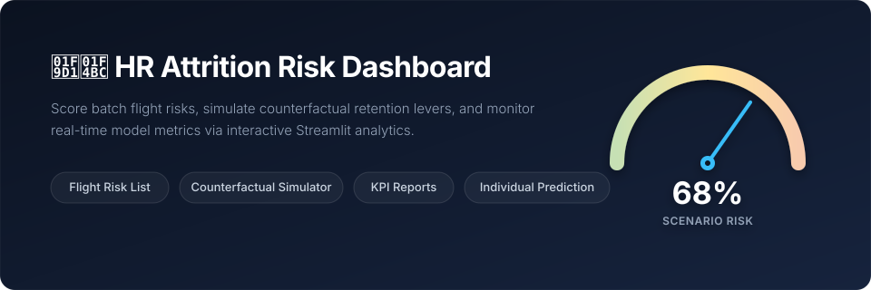

# HR Analytics: Employee Attrition & Performance
> Predicting employee flight risk to enable proactive retention.

---

## 📌 Problem Overview
HR teams often discover employee attrition too late—usually when a resignation letter is handed in. At this stage, intervention options are limited and costly. 

This project scores every active employee with an **Attrition Probability (Flight Risk Score)**, enabling HR business partners and people managers to identify retention risks early and execute targeted, data-backed interventions.

> For complete problem framing and business context, see [`docs/problem_definition.md`](docs/problem_definition.md).

---

## 🚀 Execution Pipeline
Execute the Python scripts sequentially to run data processing, model training, evaluation, and dashboard deployment:

```bash
# Install dependencies
pip install -r requirements.txt

# Step 1: Clean data, engineer features, remove data leakage, and create splits
python 01_data_engineering.py

# Step 2: Train baseline models (Logistic Regression + Random Forest)
python 02_train_baseline_models.py

# Step 3: Tune hyperparameters scoring on F1 (Train/Val only -- Test set untouched)
python 03_hyperparameter_tuning.py

# Step 4: Train XGBoost (REQUIRES INTERNET ACCESS)
# Note: If running in a restricted sandbox, copy the data/ folder to an internet-enabled machine:
pip install xgboost
python 04_train_xgboost_LOCAL.py
# Copy back: models/xgb_tuned.joblib and results/xgboost_metrics.json

# Step 5: Compare tuned models on the Test set and select final model
python 05_model_comparison_and_selection.py

# Step 6: Compute business & engineering KPIs
python 06_kpi_report.py

# Step 7: Launch interactive Streamlit interface
streamlit run 07_app.py